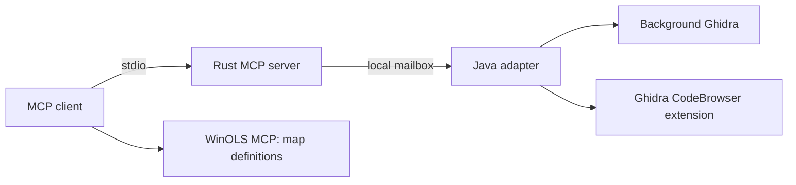

# Redline Autohaus Ghidra MCP

A Rust MCP server and Java Ghidra adapter for firmware analysis. It supports project creation, explicit language/compiler selection, raw binary import, native code analysis, annotations, and saved projects. It is a companion to [Redline WinOLS MCP](https://github.com/amirdauti/redline-autohaus-winols-mcp).

The same 36 MCP tools connect to either a background Ghidra process or a GUI extension. The background process can create and open projects before a CodeBrowser exists. The GUI extension works with the project and selected program in its CodeBrowser; project creation/open/close are handled by the background mode.



## Capabilities

All tool names start with `ghidra_`.

| Workflow | Tools |
| --- | --- |
| Context and setup | `status`, `list_languages`, `get_project`, `get_program` |
| Projects | `create_project`, `open_project`, `close_project`, `list_programs` |
| Programs | `import_program`, `select_program`, `save_program`, `export_program` |
| Analysis | `get_analysis_options`, `set_analysis_options`, `analyze`, `job_status`, `cancel_analysis` |
| Memory | `read_bytes`, `map_file_offset`, `set_image_base`, `create_memory_block` |
| Code | `list_functions`, `get_function`, `create_instructions`, `create_function`, `rename_function`, `disassemble`, `decompile` |
| Search and annotations | `get_references`, `search_bytes`, `list_symbols`, `list_strings`, `define_data`, `set_label`, `set_comment`, `go_to` |

`list_languages` enumerates the installed languages and compatible compiler specifications. Import requires a language ID, compiler ID, and explicit image base. Choices are validated by Ghidra; a raw BIN is not assumed to describe its processor or memory layout.

The server exposes a defined analysis workflow. It does not expose every Ghidra UI action, debugger, emulator, arbitrary script, or third-party extension. In particular, initial raw imports contain one contiguous block; additional uninitialized blocks model RAM. Analysis-option updates currently accept existing Boolean options, and data creation supports primitive scalars/arrays. See [the protocol and limits](docs/bridge-protocol.md).

## Requirements

- Rust toolchain selected by `rust-toolchain.toml` to build the MCP server.
- Ghidra 12.1.3 and JDK 21 for the Java adapter. Build against the Ghidra version you will run.
- PowerShell on Windows. A shell build helper is also included.
- Node.js for the optional native acceptance test; the MCP server itself does not need Node or Python.

Ghidra, Java, and customer binaries are not bundled with this repository.

## Build on Windows

```powershell
cargo build --locked --release
.\scripts\build-extension.ps1 -GhidraHome 'C:\tools\ghidra_12.1.3_PUBLIC' -JavaHome 'C:\tools\jdk-21'
```

The MCP executable is `target/release/ghidra-mcp.exe`. The version-specific extension ZIP and build metadata are in `dist/`. Java compilation uses the installed Ghidra jars, without downloading or copying them into source control.

## Start a background bridge

Create private directories for projects, imported binaries, and the mailbox. Then run:

```powershell
.\scripts\start-bridge.ps1 `
  -GhidraHome 'C:\tools\ghidra_12.1.3_PUBLIC' `
  -JavaHome 'C:\tools\jdk-21' `
  -Mailbox 'C:\GhidraWork\mailbox' `
  -ProjectRoot 'C:\GhidraWork\projects' `
  -ImportRoot 'C:\GhidraWork\inputs'

.\target\release\ghidra-mcp.exe --bridge-dir 'C:\GhidraWork\mailbox' --doctor
```

The launcher starts Java in the background and records its PID and log paths. It does not open or import a project automatically. Multiple import roots can be supplied from PowerShell as an array. Project paths and imports are restricted to their configured roots, including resolved filesystem links.

The first commands can be `ghidra_create_project`, `ghidra_list_languages`, then `ghidra_import_program`. Retain returned project/program IDs for subsequent operations. Analysis runs as a background job: poll `ghidra_job_status`, then save explicitly.

## Use the GUI extension

Install the generated ZIP through Ghidra's **File > Install Extensions**, restart Ghidra, and enable **RedlineMcpPlugin** in the CodeBrowser's **File > Configure** dialog. Alternatively use `scripts/install-extension.ps1` with the exact target version.

In the CodeBrowser choose **Tools > Redline MCP > Start bridge...** and configure the mailbox and allowed directories. It supports import/select, code inspection, analysis, annotations, saving, and navigation in that tool. The background and GUI bridges must use different mailboxes or run at different times.

To move a background-created project into the GUI, save all programs and close the project through the MCP before opening its `.gpr` in Ghidra. A project already owned by another process is not taken over. GUI project create/open/close return an explicit unsupported result; the background mode supplies those operations.

## Register with Codex

Merge [the example configuration](examples/codex-ghidra.toml) into your Codex configuration with your absolute executable and mailbox paths. MCP configuration can be global or scoped to a trusted project. [Official configuration documentation](https://learn.chatgpt.com/docs/extend/mcp?surface=cli).

```toml
[mcp_servers.ghidra]
command = 'C:\tools\ghidra-mcp\ghidra-mcp.exe'
args = ['--bridge-dir', 'C:\GhidraWork\mailbox', '--timeout-ms', '45000']
tool_timeout_sec = 60
```

Start the bridge before calling tools. `--doctor` prints a single JSON status and exits; normal execution reserves stdout for MCP messages and diagnostics for stderr.

## WinOLS interoperability

Keep the source SHA-256, Ghidra program identity, memory mapping, and live bytes together. `map_file_offset` returns all matching CPU addresses and flags aliases; do not assume a file offset equals a CPU address. Verify the relevant bytes against the WinOLS Original or selected version before transferring a definition. Imported-file hashes do not alone detect later edits in Ghidra.

Map shape, units, scaling, and functional names require evidence from the firmware or a matching definition. This MCP provides analysis operations; it does not automatically certify candidate maps or apply a tune.

## Validation and recovery

```powershell
cargo fmt --all -- --check
cargo clippy --locked --all-targets -- -D warnings
cargo test --locked --all-targets
node tests/live-ghidra.mjs --server target/release/ghidra-mcp.exe --bridge-dir C:\GhidraWork\mailbox --work-dir C:\GhidraWork\projects
```

For native acceptance, allow the test work directory as both an import root and a project location. The test generates synthetic Original/Stage1 binaries, exercises the real MCP and native Ghidra, and writes a private transcript. No customer firmware is needed.

Each mailbox permits one bridge and one MCP client. A timeout, invalid response, or interrupted mutation preserves evidence and prevents automatic retries. Inspect the last operation and the active project before clearing any pending state; see [mailbox recovery](docs/recovery.md). To stop a bridge after its current command, create a file named `stop` in its mailbox.

See [native API references](docs/java-api.md) and [live acceptance scope](docs/live-acceptance.md) for what was actually tested.
